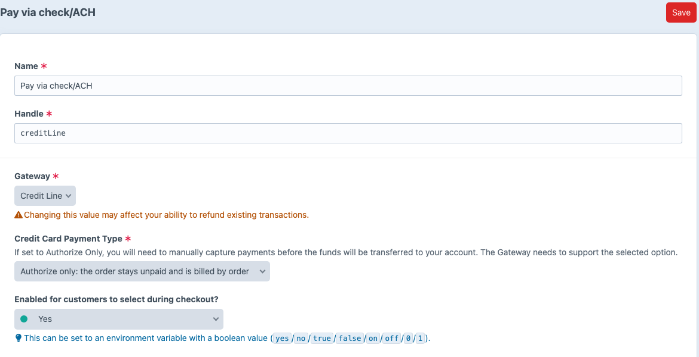
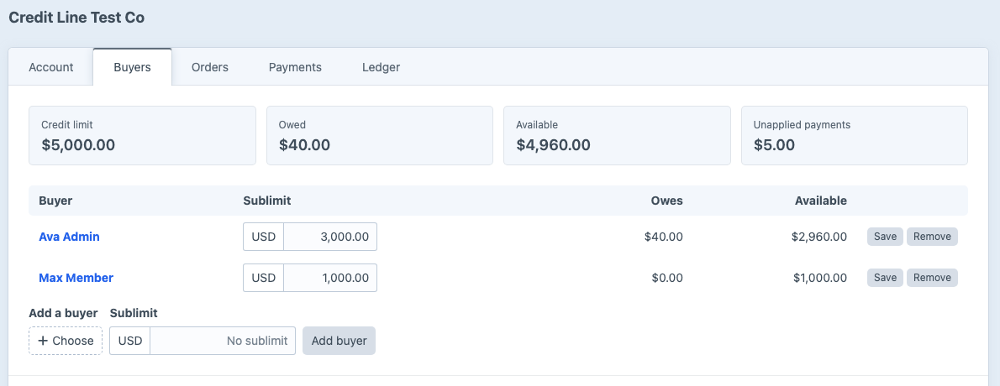

# Getting started

A Craft Commerce payment gateway that bills orders on net terms, tracks what each buyer owes, and applies recorded payments to invoices or orders.

This walks you from `composer require` to an invoice for an order charged to an account. By the end you know how an account, its buyers, the gateway and an invoice fit together.

## 1. Requirements

- Craft CMS `^5.10.0`
- Craft Commerce `^5.4.0`
- PHP `^8.2`

## 2. Install

```sh
composer require fostercommerce/commerce-net-terms
./craft plugin/install net-terms
```

## 3. Configure

Go to **Settings -> Plugins -> Net Terms**. Once you build a storefront invoice page, set **Storefront invoice path** so invoice emails link to it. For every setting, see [configuration](./reference/configuration.md).

## 4. Add the gateway

Go to **Commerce -> Settings -> Gateways -> New gateway**, choose **Net Terms**, and name it. Choose how you bill in **Credit Card Payment Type** before you take any charges:

- **Purchase**, the default, marks an order paid at checkout and bills the account on invoices you issue. This walkthrough uses it.
- **Authorize only** leaves each order unpaid, and you record payments against the orders; see [billing by order](./user-guide/order-billing.md).

Click **Save**. Use Commerce's **Match Order**, **Match Billing Address** and **Match Shipping Address** conditions to narrow which orders can use the gateway.



## 5. Open an account

Go to **Net Terms -> Accounts -> New account**.

1. Choose the **Account holder**: the customer the account belongs to. The holder becomes the account's first buyer.
2. Enter the **Credit limit**.
3. Leave **Sublimits** and **Payment terms** on their defaults.
4. Click **Save**.

## 6. Add a buyer

Only buyers can charge orders to an account, and the holder already is one. To let someone else buy on it, open the account's **Buyers** tab, choose a user, leave **Sublimit** blank, and click **Add buyer**.



## 7. Charge an order

Sign in to the storefront as the buyer and check out. Commerce lists the gateway with your other payment methods under the name you gave it, with the buyer's available credit. Choose it and pay. The order is paid in full, and the account's **Owed** figure rises by the order total.

## 8. Issue an invoice

On the account's **Invoices** tab, click **Issue and email**. The invoice bills every charge not yet invoiced, with one line per buyer, and the holder receives the invoice email.


## Where to go next

- [Accounts and buyers](./user-guide/accounts-and-buyers.md), sublimits and how Net Terms works out available credit
- [Payments](./user-guide/payments.md), recording a check and applying it to invoices
- [Reminders](./user-guide/reminders.md), emailing customers before and after a due date
- [Storefront templates](./dev-guide/storefront-templates.md), building the account and invoice pages
- [Company accounts](./dev-guide/company-accounts.md), when orders belong to a company rather than the person who places them
