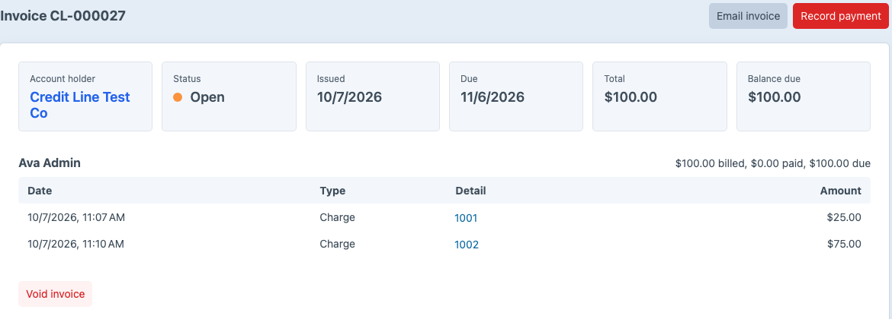
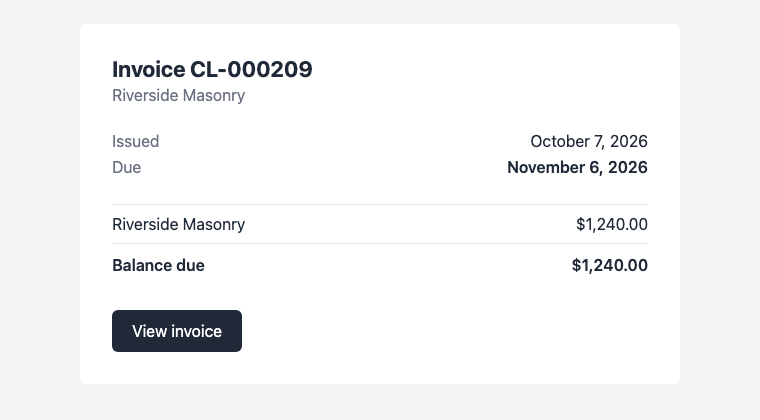

# Invoices

How what an account owes is billed, and what happens to an invoice as it is paid.

Invoices are issued only in invoice billing. In [order billing](./order-billing.md), the orders are the bills.

## Issuing an invoice

Issuing, emailing and voiding invoices, and changing their payment terms, needs the **Issue invoices, record payments and apply them** permission.

On an account's **Invoices** tab, click **Issue invoice**, or **Issue and email** to send it to the account holder as well. To issue invoices on a schedule, run the [console command](../reference/console-commands.md) from cron.

An invoice bills every charge, refund and adjustment not yet invoiced, with one line per buyer. Account adjustments made without a buyer get a line of their own. A buyer whose uninvoiced entries add up to zero or less gets no line, and those entries wait for the next invoice. When no buyer's uninvoiced entries add up to more than zero, Net Terms doesn't issue an invoice.

Invoices are numbered `CL-000001`, `CL-000002` and so on. An invoice is due its account's [payment terms](./accounts-and-buyers.md#payment-terms) after its issue date.

## Changing an invoice's payment terms

To change when one invoice is due, click **Change payment terms** on its page, enter the **Payment terms** in days from the issue date, and click **Save terms**. Net Terms moves the due date to the issue date plus those days. The account's terms and its other invoices don't change. A voided invoice's terms can't change.

For how the new due date affects reminders, see [reminders](./reminders.md#when-a-due-date-changes).

## Statuses

| Status | Meaning |
|---|---|
| Open | No payment has been applied. |
| Partially paid | Some of the balance has been paid. |
| Paid | The balance is zero. |
| Voided | The invoice was voided, and its entries go on the next invoice. |

An invoice past its due date with a balance shows as **Overdue**. To email the account holder before and after an invoice's due date, see [reminders](./reminders.md).

## The invoice email

**Email invoice** sends the invoice to the account holder's email address. When the **Storefront invoice path** setting is set, the email links to that page. To use your own email template, set **Invoice email template**; see [configuration](../reference/configuration.md).

## Voiding an invoice

To void an invoice, click **Void invoice** on its page. Net Terms doesn't void an invoice while payments are applied to it; reverse them first. A voided invoice keeps its number, and its charges go on the next invoice.
