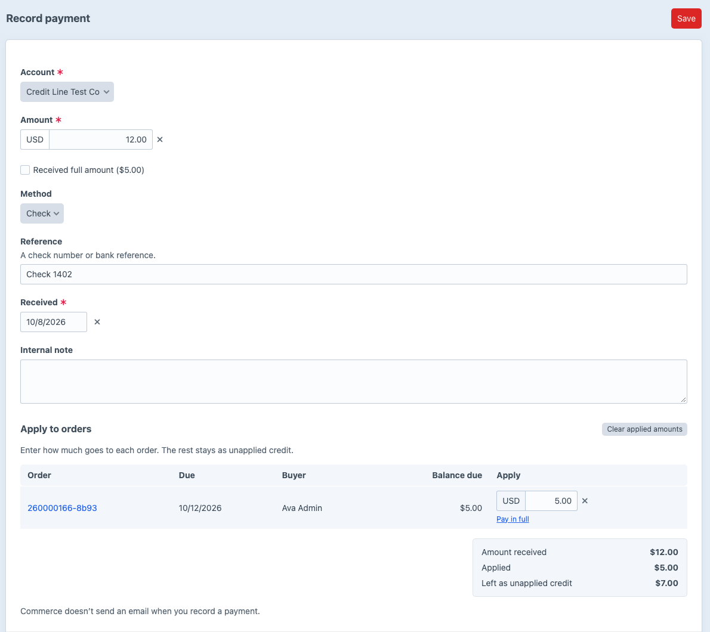
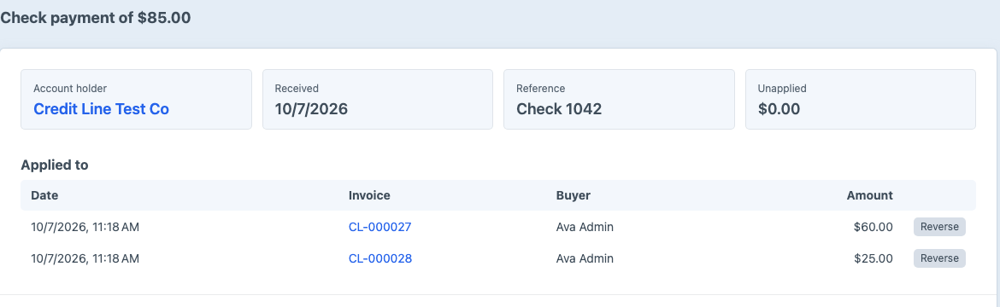

# Payments

How money received is recorded, applied to invoice lines or orders, and reversed.

## Recording a payment

Recording, applying and reversing payments needs the **Issue invoices, record payments and apply them** permission.

Go to **Net Terms -> Payments -> Record payment**, or click **Record payment** on an account's **Payments** tab or an invoice.

1. Choose the **Account**. The form lists what the account still owes on: invoice lines with a balance, or in [order billing](./order-billing.md) its unpaid and partially paid orders, oldest due first.
2. Enter the **Amount**, **Method** (card, check, ACH, wire or other) and **Reference**, such as the check number. Use **Card** for a card payment taken by phone or terminal.
3. Under **Apply to invoice lines** or **Apply to orders**, enter how much of the payment covers each one, as the payer's remittance says.
4. Click **Save**.

Three shortcuts fill the amounts for you:

- Checking **Received full amount** sets the amount to the total of the balances listed, and applies it to each line or order, oldest due first.
- **Pay in full** under a line or order applies its whole balance.
- **Clear applied amounts** empties every amount.

**Amount received**, **Applied** and **Left as unapplied credit** update as you type, and a warning shows when the applied amounts are more than the payment.

The payment and the amounts you applied save together. If the amounts add up to more than the payment, or one is more than its balance, Net Terms saves neither the payment nor the amounts. The form shows why.

Any amount you don't apply stays on the account as unapplied credit. It doesn't change what any buyer owes or reopen any buyer's credit until you apply it.

## Applying unapplied credit

On a payment's page, the same table lists what the account still owes on. Enter the amounts and click **Save**. Applying a payment takes the amount off what the buyer owes, which frees the same amount of their credit.

## Reversing an application

To undo an application, click **Reverse** beside it on the payment or invoice page. The amount goes back onto the buyer and back to the payment's unapplied credit. In invoice billing, the ledger keeps both the payment and its reversal. In order billing, Net Terms adds a refund transaction to the order instead; see [changes after checkout](./order-billing.md#changes-after-checkout).
